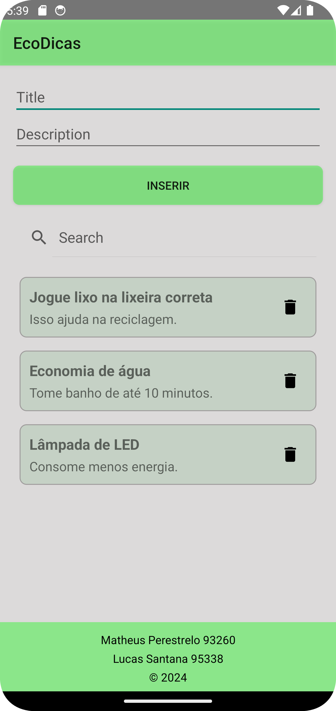
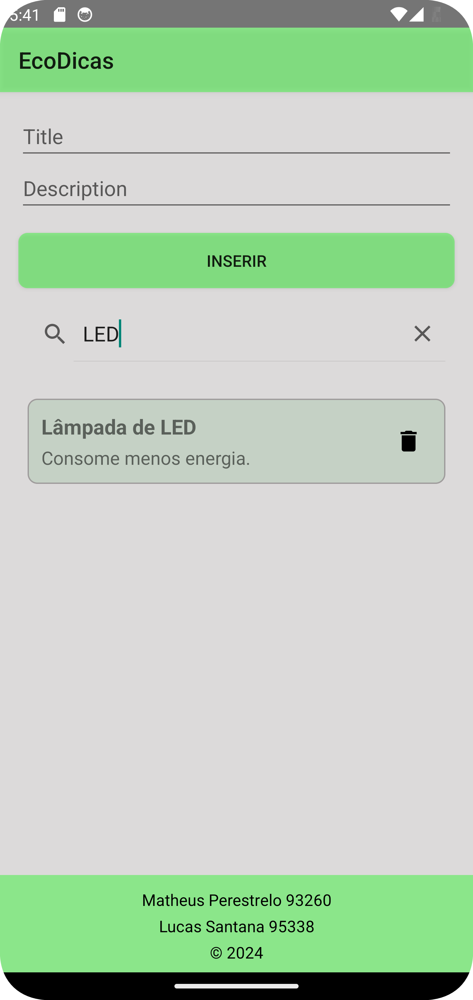
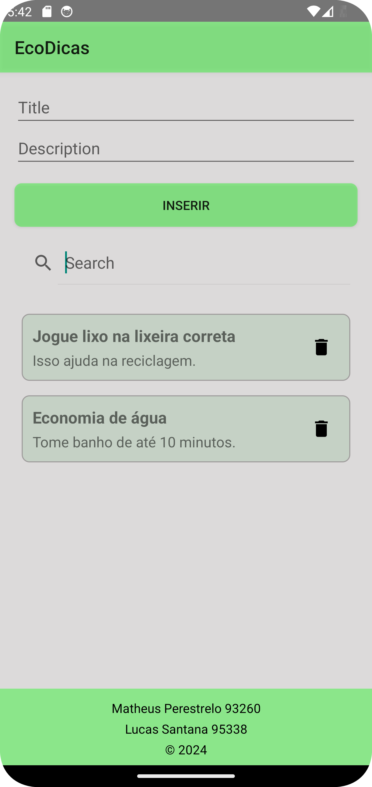

# EcoDicas App 🌱

Um aplicativo Android para compartilhar e gerenciar dicas sustentáveis.

## 👥 Integrantes

- **Matheus Felipe Domingues Perestrelo** - 93260
- **Lucas Santana de Paula** - 95338

## 📱 Sobre o Projeto

O EcoDicas é um aplicativo desenvolvido para Android que permite aos usuários:
- Adicionar dicas sustentáveis com título e descrição
- Buscar dicas específicas usando a barra de pesquisa
- Visualizar todas as dicas em uma lista organizada
- Remover dicas quando necessário

## 🛠️ Tecnologias Utilizadas

- Kotlin
- Android Studio
- RecyclerView para listagem de itens
- SearchView para funcionalidade de busca
- MVVM (Model-View-ViewModel) Architecture

## 🎯 Funcionalidades

- ✅ Adicionar novas dicas
- 🔍 Buscar dicas existentes
- 📝 Visualizar dicas em cards organizados
- ❌ Remover dicas
- 🎨 Interface amigável e intuitiva

## 🎨 Design

- Cores suaves e eco-friendly
- Cards com cantos arredondados
- Botões intuitivos
- Layout responsivo e organizado

## 📸 Screenshots

 
 
 
 
 

   <em>Da esquerda para direita: Tela inicial, Busca de dicas, Deletar Dicas, Inserir Discas</em>
 

